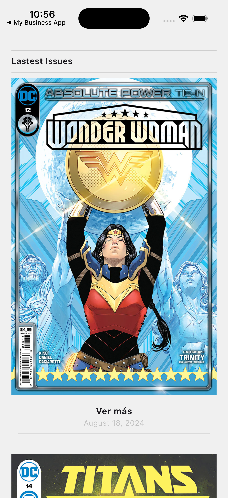

# Comic Book App - Prueba Técnica

Este proyecto es una aplicación de cómics desarrollada en **Flutter** como parte de una prueba técnica. La aplicación permite explorar las últimas novedades de cómics y ver sus detalles interactuando con la API de Comic Vine, soportando tanto un modo offline (mock data) como un modo online en tiempo real.

---

## 📱 Vista Previa (Home)

<p align="center">
  
</p>

---

## 🚀 Características Clave


- **Clean Architecture**: Diseño modular que separa las responsabilidades en capas claras (Data, Domain, Presentation y Core).
- **Gestión de Estado con BLoC/Cubit**: Implementación limpia del flujo de datos y estados en la interfaz.
- **Soporte de Mock Data (Offline)**: Posibilidad de ejecutar y probar toda la aplicación localmente sin necesidad de credenciales o conexión a internet.
- **Evitación de Bloqueos de CDN**: Configuración de encabezados personalizados (`User-Agent`) en las solicitudes HTTP e imágenes de Comic Vine para prevenir errores de tipo `SocketException (Connection reset by peer)`.
- **Integración con Swift Package Manager (SPM)**: Proyecto de iOS totalmente libre de CocoaPods, migrado de forma nativa a SPM para un proceso de construcción óptimo y rápido en Xcode.

---

## 📁 Arquitectura y Estructura del Proyecto

El código fuente de la aplicación se encuentra organizado bajo las directrices de **Clean Architecture**:

```text
lib/
├── main.dart                      # Punto de entrada de la aplicación
└── app/
    ├── core/                      # Código compartido y de infraestructura global
    │   ├── adaptative_screen/     # Utilidades para diseño responsivo
    │   ├── constants/             # Constantes globales (ej. encabezados User-Agent)
    │   └── utils/                 # Utilidades generales y helpers
    ├── domain/                    # Capa de dominio (Lógica de negocio pura)
    │   ├── failures/              # Definición de fallos/errores del sistema
    │   ├── repositories/          # Contratos e interfaces de repositorios
    │   └── responses/             # Modelos de respuesta de la API (Generados por Freezed)
    ├── data/                      # Capa de datos (Implementación del negocio)
    │   ├── data_source/           # Proveedores de datos locales y externos
    │   ├── helpers/http/          # Cliente HTTP personalizado basado en Dio
    │   └── repositories_impl/     # Implementación concreta de los repositorios
    ├── presentation/              # Capa de presentación (Interfaz de Usuario)
    │   ├── global/                # Extensiones, temas de color y componentes reutilizables
    │   ├── modules/               # Módulos de la aplicación
    │   │   ├── blocs/             # Cubits para el control del estado (Home, ComicItem)
    │   │   └── views/             # Pantallas e interfaces visuales (Home, Detalle)
    │   └── router/                # Configuración de rutas usando GoRouter
    ├── bloc_providers.dart        # Proveedor central de BLoC
    ├── inject_dependencies.dart   # Inyección de dependencias con GetIt
    ├── load_env.dart              # Inicialización de variables de entorno
    └── my_app.dart                # Configuración del widget raíz
```

---

## 🛠️ Instalación y Configuración

### Prerrequisitos

- Tener instalado Flutter (versión `^3.5.0` o superior).
- Un simulador de iOS/Android o dispositivo físico para pruebas.

### Pasos para Empezar

1. **Clonar el repositorio**:
   ```bash
   git clone git@github.com:bakamedi/comic_app.git
   cd comic_app
   ```

2. **Instalar dependencias**:
   ```bash
   flutter pub get
   ```

3. **Generar los modelos y serializadores**:
   El proyecto utiliza `freezed` y `json_serializable`. Debes generar los archivos de código usando `build_runner`:
   ```bash
   flutter pub run build_runner build --delete-conflicting-outputs
   ```
   *Nota: Si estás haciendo cambios interactivos, puedes usar `watch` en su lugar:*
   ```bash
   flutter pub run build_runner watch --delete-conflicting-outputs
   ```

4. **Crear el archivo de configuración `.env`**:
   Crea un archivo llamado `.env` en la raíz del proyecto para definir las credenciales y el modo de ejecución:
   ```env
   API_KEY=tu_api_key_de_comicvine # Obtener de: https://comicvine.gamespot.com/api/documentation
   USE_MOCK_DATA=TRUE              # Configura TRUE para usar mock data local, o FALSE para consumir la API real
   ```

---

## 🧪 Ejecutar la Aplicación

Una vez configurado el archivo `.env`, puedes iniciar la aplicación en tu dispositivo o simulador:

```bash
flutter run
```

Para realizar la compilación de iOS en simulador sin CocoaPods (usando Swift Package Manager):

```bash
flutter build ios --simulator
```
